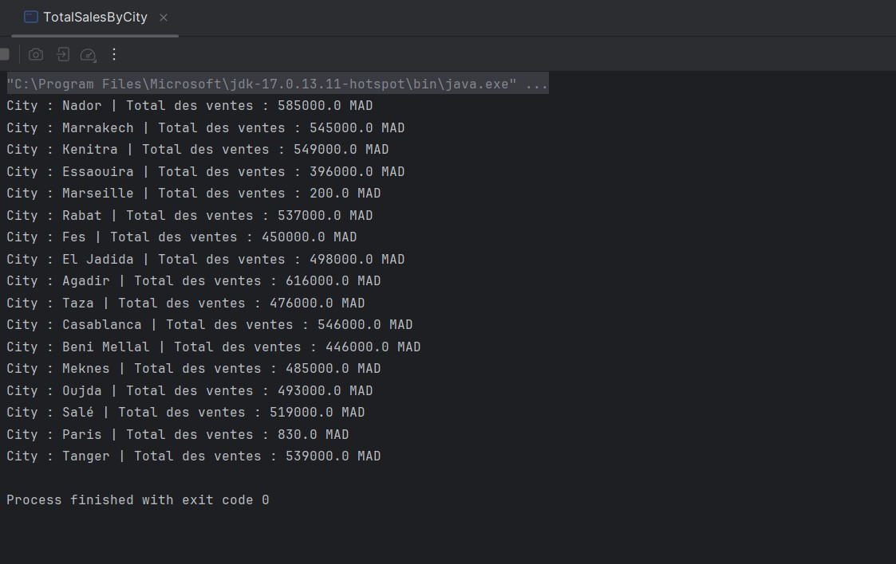
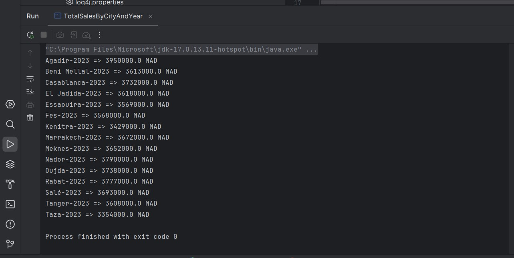

# 📊 Total Ventes – Apache Spark (Java)  Programmationn des RDDs

Projet Spark RDD en Java pour le calcul des ventes par ville et par ville/année.

---

## 🎯 Objectif pédagogique

- Manipuler des **RDD Spark** en Java pour le traitement distribué de données.
- Appliquer des transformations comme `mapToPair`, `reduceByKey`, `sortByKey`.
- Charger des fichiers de données (`text.txt`, `sales.txt`) avec Spark.
- Structurer un projet Maven avec configuration propre (Log4j, pom.xml).
- Produire des résultats clairs sans logs parasites grâce à la configuration de logs.
---

## 🧠 Fonctionnalités

- 🔍 Lecture de fichiers CSV simples (`text.txt` et `sales.txt`)
- 🏙️ Agrégation des ventes par **ville**
- 📆 Agrégation des ventes par **ville et année**
- 📊 Affichage des résultats dans la console

---

## 📸 Aperçu visuel


### 🧮 Exercice 1 — Total des ventes par ville



---

### 📆 Exercice 2 — Total des ventes par ville et par année



---

## 🚀 Lancer le projet

### 📦 Compilation

```bash
mvn clean compile

### ▶️ Démarrage

1. Cloner le dépôt :

```bash
https://github.com/LAMBARAA-Abdellah/tp-spark-rdds-ventes
cd tp-spark-rdds-ventes
